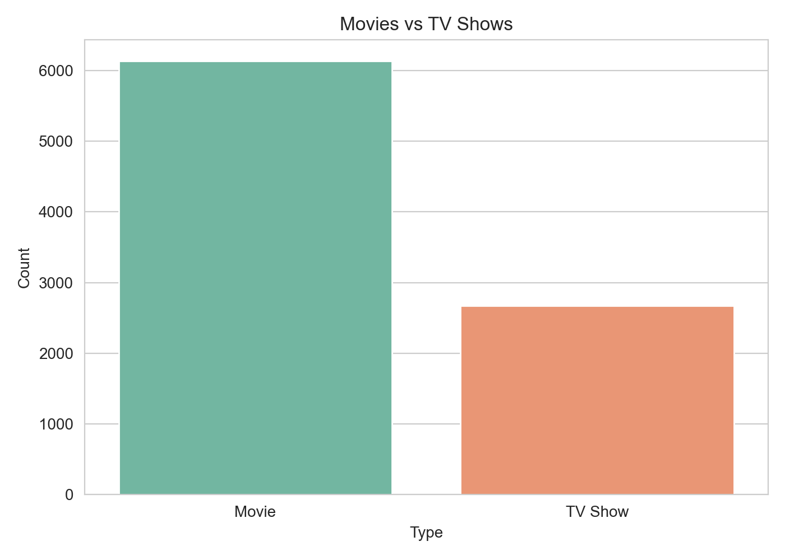
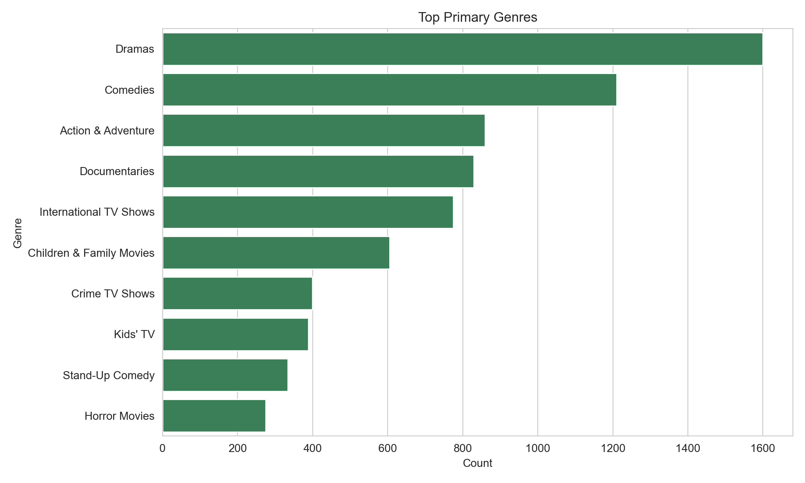
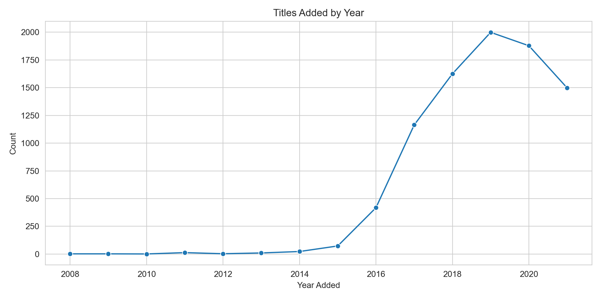

# Netflix Content Analysis Project

This project explores the Netflix titles dataset using Python, pandas, seaborn, matplotlib, and Jupyter Notebook. The main goal of the project is to understand the Netflix catalog by looking at content type, genres, countries, release patterns, and text from descriptions.

## Project Objective

The objective of this project is to perform data analysis on the Netflix titles dataset and answer questions such as:

- What type of content is more common on Netflix?
- Which genres appear the most?
- Which countries contribute the most titles?
- How has Netflix content changed over time?
- What patterns can be found in content descriptions?

## Project Files

- `notebooks/netflix_content_visualizations.ipynb`
  Main notebook with the complete analysis and inline charts.
- `visualize_content.py`
  Python script version for generating similar visualizations.
- `netflix_titles.csv/netflix_titles.csv`
  Dataset used for the project.
- `assets/`
  Images used in this README for quick project preview.

## Tools Used

- Python
- pandas
- matplotlib
- seaborn
- Jupyter Notebook

## Analysis Covered

- Data cleaning
- Missing values analysis
- Univariate analysis
- Bivariate analysis
- Time-series analysis
- Country and genre deep dive
- Text analysis on descriptions
- Final observations

## Sample Visual Outputs

### Movies vs TV Shows



### Top Primary Genres



### Titles Added by Year



## Key Insights

- Movies appear more frequently than TV shows in the dataset.
- A few countries contribute a large share of the available titles.
- Drama and international content show up very often in the catalog.
- Netflix content additions increased strongly in later years.
- Some titles were added to Netflix long after their original release year.
- Description text can also be used to identify repeated themes and common keywords.

## Future Improvements

- Add director and cast analysis
- Add correlation heatmaps and more advanced comparisons
- Build an interactive dashboard version of the project
- Perform deeper NLP analysis on the description column
- Compare Netflix content trends by region

## How to Run

Open the notebook:

```powershell
jupyter notebook
```

Then open:

`notebooks/netflix_content_visualizations.ipynb`

To run the Python script directly:

```powershell
python visualize_content.py
```

## Repository Notes

The notebook file already contains executed outputs, so charts and analysis results can be viewed directly after opening it.
